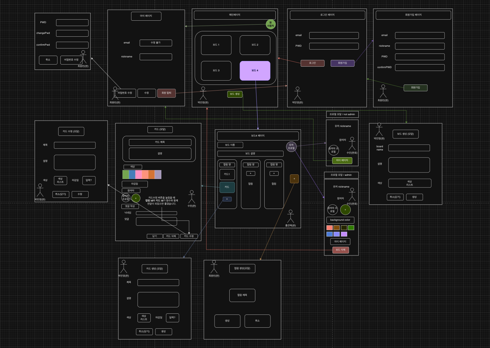
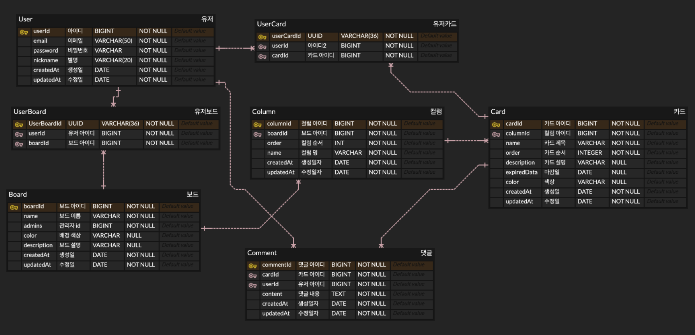

# Canbanboard Project

## 프로젝트 설명

> 칸반보드를 간단하게 구현하는 프로젝트 입니다.  
> 해당 프로젝트의 `주요 해결과제`는 컬럼 또는 카드를 옮길 때 마다 `변경된 나열 순서를 데이터베이스에 저장`해야 한다는 점입니다.

## 와이어프레임

[링크](https://app.diagrams.net/#G1ldiSdfQfSVv1SSo2lZBG7Ez6HVTAv_zq)


## ERD

[링크](https://www.erdcloud.com/d/Jb2E6S75etdgbJc8d)


## API

내용이 너무 많아서 [링크](https://feather-almanac-87a.notion.site/6-API-34d619705fc24f12b53c3dfbed85040f?pvs=4)만 제공합니다.

## 프로젝트 시연 영상

[시연영상](https://www.youtube.com/watch?v=IDiuq1T85rM)

## Trouble-Shooting

`async와 await를 사용하는 비동기 함수의 코드 실행 순서를 제대로 이해하지 못해서` 발생한 어려움을 겪었습니다.

```html
<div id="columnLists" class="d-flex flex-wrap justify-content-around columnBox">
  <div draggable="true" class="column m-9"></div>
</div>

<script>
  // 컬럼 드래그 이벤트 등록 함수
  const dragEvent = (boardId) => {
    const columnDraggables = document.querySelectorAll('.column');
    columnDraggables.forEach((draggable) => {
      // class="column" 태그를 마우스로 잡아 들어올리는 순간
      draggable.addEventListener('dragstart', (event) => {
        draggable.classList.add('dragging');
      });

      draggable.addEventListener('dragend', (event) => {
        draggable.classList.remove('dragging');
      });
    });
  };
</script>
```

위 코드를 보시면 쿼리 셀렉터로 지정한 `.column` 태그를 대상으로 마우스 드래그를 시작할 때와 마칠 때에 대한 `addEventListener`를 등록하고 있습니다. 참고로 `.column`을 담은 `columnDraggables` 변수는 백엔드의 데이터베이스에서 가져온 Column 테이블 정보를 기반으로 프론트에 뿌려지는 태그입니다. 그러므로 `document.querySelectorAll('.column');`

```html
<script>
  // 컬럼 정보를 DB에서 가져와서 프론트에 뿌려주는 함수입니다.
  async function getColumns(boardId) {
    const response = await fetch(`/api/boards/${boardId}/columns`);
    const data = await response.json();
    const columns = data.columns;

    // 가져온 정보를 태그에 담아 프론트에 뿌려줍니다.
    const columnLists = document.getElementById('columnLists');
    columnLists.innerHTML = ''; // 기존 태그를 비우고,
    for (const column of columns) {
      // class="column" 태그를 반복문으로 뿌려줍니다.
      columnLists.innerHTML += `
        <div draggable="true" class="column m-9" data-columnId=${column.columnId}>
          ... 
          `;
    }
  }
</script>
```

보시면 `column`이라는 클래스를 가진 div 태그가 for문으로 생성되는 것을 확인할 수 있는데 여기서 주목해야 할 점은 `getColumns` 이 함수가 비동기 함수 인 fetch를 갖고 있다는 점입니다.

html 파일 내 전체 script의 코드가 순차적으로 실행된다고 생각했을 때 `getColumns` 함수를 먼저 실행해서 컬럼 정보를 프론트에 노출시킨 뒤 `dragEvent` 함수를 실행하여 컬럼 태그에 마우스 드래그 이벤트를 등록하니 문제가 없다고 생각했습니다.

하지만 await가 붙은 비동기 함수(여기서는 fetch)는 요청이 완료(fulfilled)되는 동안 다른 코드를 먼저 실행한다는 점을 간과하고 있었습니다. 그렇기 때문에 코드의 작성 순서상으로 `getColumns`를 배치한 뒤 에 `dragEvent`를 배치한다 하더라도 `getColumns` 안에 있는 비동기 함수인 `await fetch`를 만나면서 요청 대기 상태가 되고, 그 동안에 `dragEvent` 함수가 실행되므로 사실상 컬럼 태그에 이벤트리스너가 등록되지 않는다는 것을 뒤늦게 발견하였습니다.

```html
<script>
  // 컬럼 정보를 DB에서 가져옵니다.
  async function getColumns(boardId) {
    const response = await fetch(`/api/boards/${boardId}/columns`);
    const data = await response.json();
    const columns = data.columns;

    // 가져온 정보를 담아 html을 뿌려줍니다.
    const columnLists = document.getElementById('columnLists');
    columnLists.innerHTML = ''; // 기존 태그를 비우고,
    for (const column of columns) {
      // 여러 컬럼 html태그를 반복문으로 뿌려줍니다.
      columnLists.innerHTML += `
        <div draggable="true" class="column m-9" data-columnId=${column.columnId}>`;
      // ... 생략 ( 프론트에 div태그 뿌리는 중)
    }

    // div태그가 다 뿌려진 다음 이벤트 리스너 등록
    dragEvent(boardId); // 드래그 이벤트 등록
  }
</script>
```

결론적으로 이벤트리스너 등록 함수(`dragEvent`)를 fetch함수가 포함된 `getColumns` 함수 안에 둠으로서 문제를 해결할 수 있었습니다.  
그렇게 하면 프론트에 class="column" 태그가 뿌려진 뒤에 dragEvent 함수로 이벤트를 등록하는 순서를 보장받을 수 있기 때문입니다.

> 📌 **_배운점 요약_**  
> `비동기 함수(fetch)에 await가 붙으면 요청을 완료할 때 까지 대기 상태에 돌입한다.`  
> 그래서 getColumns 함수 전체가 대기 상태가 된 것이다.  
> 하지만 마냥 getColumns 함수를 기다리고만 있을 수는 없으니 `getColumns 함수를 빠져나와 그 다음 코드를 실행한다.`

## 각 팀원들의 어려웠던 점(소감)

### 원빈님

프론트를 백엔드와 연결하는 부분에서 어려움을 겪으면서 많이 알게 되었던 것 같습니다. 예를 들어 백엔드에서 받아오던 params를 프론트 엔드에서는 URLSearchParams 를 사용해 가져오거나 특정 태그의 하위 태그들을 선택할 때 columnBox > div 처럼 화살표를 사용하거나 백엔드의 오류 메시지를 받아서 alert를 사용해 화면에 표시하는 등 구글에 검색해 보며 프론트를 더 다양하게 사용해 볼 수 있어서 좋은 경험이었던 것 같습니다.

```html
<script>
  // 컬럼 생성
  document.getElementById('createColumnBtn').addEventListener('click', async function createColumn() {
    // boardId 가져오기
    let boardId = new URLSearchParams(window.location.search).get('boardId');
    boardId = Number(boardId);
    // 컬럼 order
    let columns = document.querySelectorAll('.columnBox > div');
    let columnCnt = 0;
    for (let column of columns) {
      columnCnt++;
    }
    columnCnt += 1;
    const columnName = document.getElementById('columnName').value;
    try {
      const response = await fetch(`/api/boards/${boardId}/columns`, {
        method: 'POST',
        headers: {
          'Content-Type': 'application/json',
        },
        body: JSON.stringify({
          name: columnName,
          order: columnCnt,
        }),
      });
      const data = await response.json();
      if (response.ok) {
        console.log(data.message);
        location.reload();
      } else {
        alert(data.message);
      }
    } catch (err) {
      console.error('Error:', err);
    }
  });
</script>
```

### 수민님

erd 다이어그램을 작업하는데 관계설정을 하는데 다대다인지 일대다인지 헷갈리는 경우가 많았고, api를 작업하는데 작성할 것도 많고 작업할수록 헷갈리게 되어 힘들었습니다.

코드로는 프론트 작업 중 보드아이디로 여러 유저정보들을 찾아내야해서 고민하다 백엔드에서 아래와 같이 작성해주었고, 불러와 사용했습니다.

```javascript
getJoinUser = async (boardId) => {
  let users = await UserBoard.findAll({ where: { boardId }, attributes: [], include: [{ model: User }] });
  if (!users) {
    throw new CustomError(404, '참여자가 없습니다.');
  }
  users = users.map((user) => user.User);
  return users;
};
```

그리고 모달창에 데이터들을 뿌려주는데 저번처럼 버튼이 먹히지않을까 두려워 값이 필요한 곳만 아래와 같이 넣어줬습니다.

```html
<script>
document.getElementById(
'nickname'
).innerHTML = `<input type="text" readonly class="form-control-plaintext" value="${data.nickname}">`;
//또는
document.getElementById('backgoundColor').value = data.color;
```

### 진택님

프론트 작업중 `보드아이디로 컬럼 정보와 카드 정보를 불러와 붙여넣어야 해서 고민을 많이 하였다.`
서로 얽혀있어서 카드 정보를 불러오는데 조금 고군분투하였다. 그리고 `html을 붙이는 과정에서 카드 생성 버튼을 누르면 모든 컬럼에서 카드가 생성되는 오류를 발견`하였고 생각보다 간단하게 `카드 생성 버튼에 아이디 값을 컬럼 아이디로 붙여넣어 해결`하였다
아래 코드로 작성했다.

```html
<script>
  // 프론트 노출
  async function getColumns(boardId) {
    try {
      const response = await fetch(`/api/boards/${boardId}/columns`);
      const data = await response.json();
      const columns = data.columns;
      let cards;
      const columnLists = document.getElementById('columnLists');
      columnLists.innerHTML = '';

      for (const column of columns) {
        cards = await getCardsByColumnId(column.columnId);
        const cardsTags = cards
          .map(
            (card) => `
              <div 
                draggable="true" 
                class="card" 
                style="background-color:${card.color};" 
                onclick="updateCard(${column.columnId},${card.cardId})"
              ><input 
                type="text" readonly 
                class="form-control-plaintext" 
                id="cardName" 
                value="${card.name}"
              ></div>
              `
          )
          .join('');

        columnLists.innerHTML += `
          <div 
            draggable="true" 
            class="column m-9" data-columnId=${column.columnId}
            ><div
              ><input 
                type="text" 
                class="form-control" 
                id="columnName" value="${column.name}"
              ><button 
                id="modifyColumnBtn" 
                type="button" 
                class="btn btn-info" 
                onclick = "modifyColumnBtn(${column.columnId}, ${boardId}, event)"
              >수정</button>
              <button 
                id="dltColumnBtn" 
                type="button" 
                class="btn btn-danger" 
                onclick = "dltColumnBtn(${column.columnId}, ${boardId}"
              >삭제</button>
            </div>
            <div 
              class="cardBox"
            >${cardsTags}
            </div>
              <button 
                id="${column.columnId}" 
                type="button" 
                class="btn btn-secondary" 
                onclick="createCard(${column.columnId}, event)"
              >card +</button>
            </div>
          </div>`;
      }
      columnDragLogic(boardId);
      cardDragLogic(cards);
    } catch (error) {
      console.error(error);
    }
  }

  // 백엔드 요청
  async function getCardsByColumnId(columnId) {
    const response = await fetch(`/api/columns/${columnId}/cards`);
    const data = await response.json();
    const cards = data.data;
    return cards;
  }
</script>
```

### 민영님

함수의 파라미터로 콜백 함수를 반영하여 코드를 작성하는 로직을 한 번 적용해 보고 싶었는데 이번에 가볍게나마 시도해보고 직접 경험해볼 수 있어서 좋았습니다. 콜백 함수를 이용하여 fetch를 통한 데이터 요청 로직과 받은 데이터를 기반으로 프론트에 뿌려주는 로직을 분리해 보았습니다.

```html
<script>
  //* 초기 세팅
  // 보드 목록 나열
  $(document).ready(() => {
    const boardBox = $('.boardBox');
    boardBox.empty();

    getBoards((data) => {
      data.forEach((data) => {
        const board = $(`
            <div 
              class="board m-4" 
              onclick="boardDetailPage(${data.boardId})"
              ><label 
                for="boardName" 
                class="col-sm-2 col-form-label"
              >${data.name}</label>
            </div>`);

        board.css('background-color', data.color);
        boardBox.append(board);
      });
    });
  });

  // 콜백함수 적용
  async function getBoards(callback) {
    try {
      const response = await fetch('/api/boards');
      const data = await response.json();
      if (response.ok) {
        callback(data.data);
      } else {
        alert(data.message);
        // 로그인 필요 시 로그인 페이지로 이동
        window.location.href = '/login';
      }
    } catch (err) {
      console.error('Error:', err);
    }
  }
</script>
```
